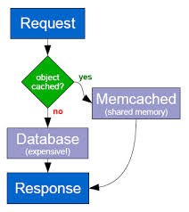

## Using Memcached

Memcached is the “memory cache daemon.” Its impact on many large Internet services has been, by all
accounts, revolutionary. After glancing at how to use it from Python, we will discuss its implementation,
which will teach us about a very important modern network concept called sharding.


The actual procedures for using Memcached are designed to be very simple:
- You run a Memcached daemon on every server with some spare memory.
- You make a list of the IP address and port numbers of your new Memcached
daemons, and distribute this list to all of the clients that will be using the cache.
- Your client programs now have access to an organization-wide blazing-fast keyvalue
cache that acts something like a big Python dictionary that all of your servers
can share. The cache operates on an LRU (least-recently-used) basis, dropping old
items that have not been accessed for a while so that it has room to both accept
new entries and keep records that are being frequently accessed.



Enough Python clients are currently listed for Memcached that I had better just send you to the page
that lists them, rather than try to review them here: http://code.google.com/p/memcached/wiki/Clients.
The client that they list first is written in pure Python, and therefore will not need to compile against
any libraries. [Memcached](https://pypi.python.org/pypi/python-memcached/1.53) can be install thanks to being
available on the Python Package Index:
```
root@erlerobot:~/Python_files# pip install python-memcached
``
The interface is straightforward. Though you might have expected an interface that more strongly
resembles a Python dictionary with native methods like `__getitem__`, the author of python-memcached
chose instead to use the same method names as are used in other languages supported by
Memcached—which I think was a good decision, since it makes it easier to translate Memcached
examples into Python :
```python
>>> import memcache
>>> mc = memcache.Client(['127.0.0.1:11211'])
>>> mc.set('user:19', '{name: "Lancelot", quest: "Grail"}')
True
>>> mc.get('user:19')
'{name: "Lancelot", quest: "Grail"}'
```
The basic pattern by which Memcached is used from Python is shown in `squares.py`. Before
embarking on an (artificially) expensive operation, it checks Memcached to see whether the answer is
already present. If so, then the answer can be returned immediately; if not, then it is computed and
stored in the cache before being returned.
```python

import memcache, random, time, timeit
mc = memcache.Client(['127.0.0.1:11211'])

def compute_square(n):
    value = mc.get('sq:%d' % n)
    if value is None:
        time.sleep(0.001)  # pretend that computing a square is expensive
        value = n * n
        mc.set('sq:%d' % n, value)
    return value

def make_request():
    compute_square(random.randint(0, 5000))

print 'Ten successive runs:',
for i in range(1, 11):
    print '%.2fs' % timeit.timeit(make_request, number=2000),
print
```

The Memcached daemon needs to be running on your machine at port 11211 for this example to
succeed. For the first few hundred requests, of course, the program will run at its usual speed. But as the
cache begins to accumulate more requests, it is able to accelerate an increasingly large fraction of them.
```
root@erlerobot:~/Python_files# python squares.py

Ten successive runs: 2.75s 1.98s 1.51s 1.14s 0.90s 0.82s 0.71s 0.65s 0.58s 0.55s
```

This pattern is generally characteristic of caching: a gradual improvement as the cache begins to
cover the problem domain, and then stability as either the cache fills or the input domain has been fully
covered.

You must always remember that Memcached is a cache; it is ephemeral, it uses RAM for
storage, and, if re-started, it remembers nothing that you have ever stored! Your application should
always be able to recover if the cache should disappear.


